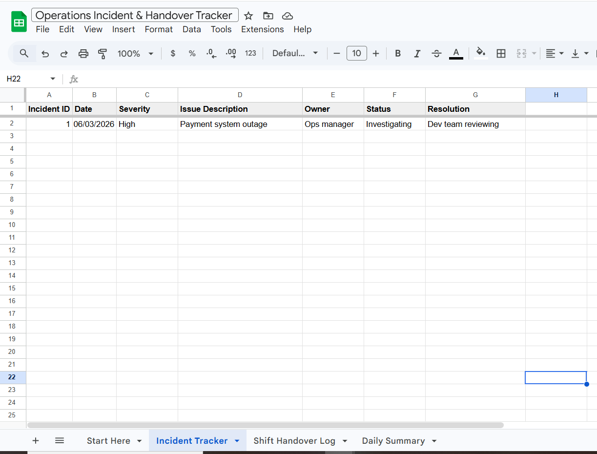
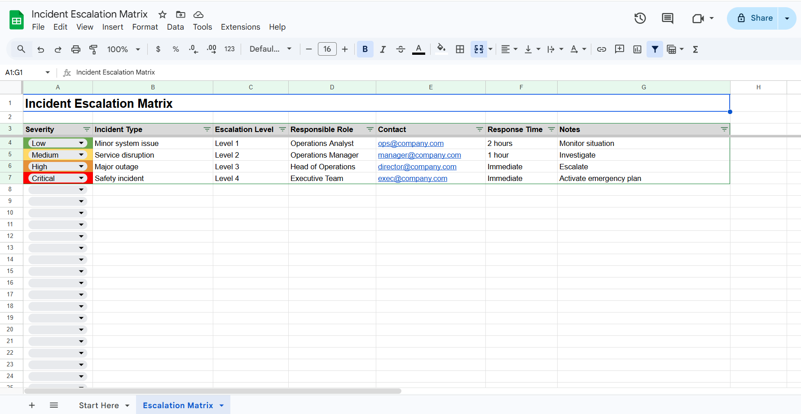

# OpsTemplateHub

Professional spreadsheet templates for IT Operations teams.

These templates help teams track incidents, manage escalations, run shift handovers and document root cause analysis.

Designed for:
• IT Operations teams  
• NOC teams  
• DevOps teams  
• Service Desk teams  
• Support teams  

---

## Available Templates

## Incident Tracker

## Escalation Matrix

---

## Get the Templates

Full templates available here:

Etsy  
https://etsy.com/shop/OpsTemplateHub

Gumroad  
https://gumroad.com/opstemplatehub

---

## About OpsTemplateHub

OpsTemplateHub provides simple operational templates for teams that don't want the complexity of tools like Jira or ServiceNow.

The goal is to give teams lightweight spreadsheets they can start using immediately.
